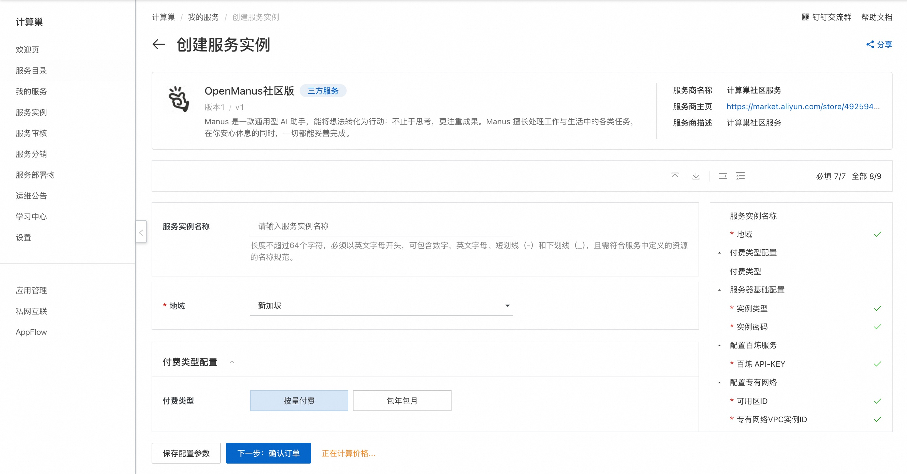
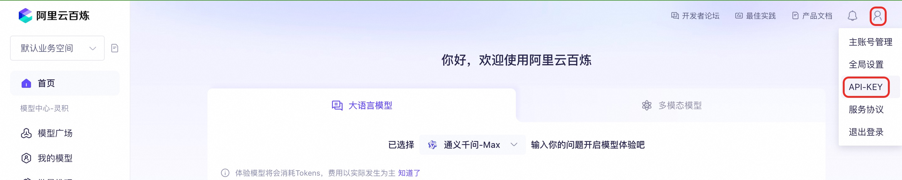
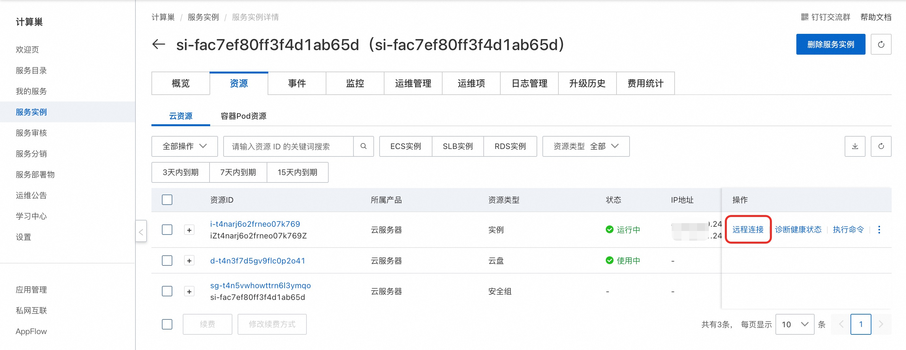
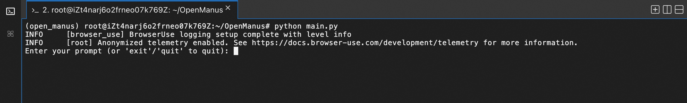
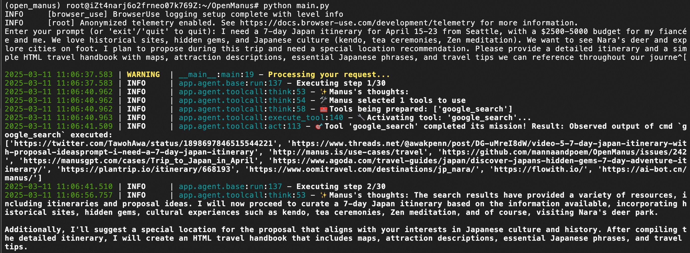

# 社区版 快速部署

## 概述

Manus 是一款通用型 AI 助手，能将想法转化为行动：不止于思考，更注重成果。Manus 擅长处理工作与生活中的各类任务，在你安心休息的同时，一切都能妥善完成。详情请查看[Manus官网](https://manus.im/)。

## 前提条件

部署OpenManus社区版服务实例，需要对部分阿里云资源进行访问和创建操作。因此您的账号需要包含如下资源的权限。
**说明**：当您的账号是RAM账号时，才需要添加此权限。

| 权限策略名称                          | 备注                         |
|---------------------------------|----------------------------|
| AliyunECSFullAccess             | 管理云服务器服务（ECS）的权限           |
| AliyunVPCFullAccess             | 管理专有网络（VPC）的权限             |
| AliyunROSFullAccess             | 管理资源编排服务（ROS）的权限           |
| AliyunComputeNestUserFullAccess | 管理计算巢服务（ComputeNest）的用户侧权限 |

## 计费说明

OpenManus 社区版在计算巢部署的费用主要涉及：

- 所选vCPU与内存规格
- 系统盘类型及容量
- 公网带宽

## 部署流程

1. 访问计算巢OpenManus社区版[部署链接](https://computenest.console.aliyun.com/service/instance/create/cn-hangzhou?type=user&ServiceName=OpenManus%E7%A4%BE%E5%8C%BA%E7%89%88)，按提示填写部署参数：
   

2. 部署参数需要百炼API-KEY，**[登录百炼控制台](https://bailian.console.aliyun.com/)**，光标悬停在右上角人行图标上，点击**API-KEY**。
    

    点击**创建我的API-KEY**，并复制它备用。API-KEY是个人保密信息，切勿泄漏。若未开通百炼，请点击[开通百炼的模型服务](https://help.aliyun.com/zh/model-studio/getting-started/first-api-call-to-qwen?spm=a2c4g.11186623.help-menu-2400256.d_0_1_0.5a06b0a8lg5WY2#5058e161041ps)。
    

3. 参数填写完成后可以看到对应询价明细，确认参数后点击**下一步：确认订单**。

4. 确认订单完成后同意服务协议并点击**立即创建**进入部署阶段。

5. 等待部署完成后在服务实例资源页远程连接ECS。
   

6. 连接ECS后，执行以下命令运行openmanus。
   ```shell
   sudo su
   cd /root/OpenManus
   conda activate open_manus
   python main.py
   ```
   

7. 输入任务后开始运行，用法请参考[用例展示](https://manus.im/usecases)。
    
